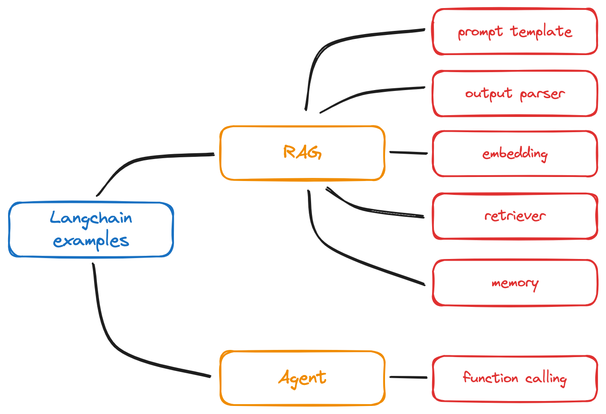

# langchainjs-examples

## 介绍

理解大模型应用的构建思路，学习使用[LangChain.js](https://github.com/langchain-ai/langchainjs)。

## 指南

```
git clone https://github.com/handoing/langchainjs-examples
cd langchainjs-examples/
npm install
npm run example // 执行项目示例
```

## 脑图

